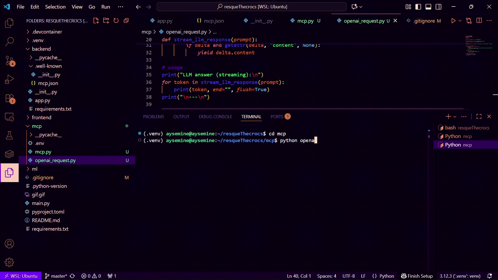

# 🐊 [Crocodile Conservation & Prediction Web App(MCP-enabled)](https://resquethecrocs.streamlit.app/)

Spotted a crocodile and curious whether it’s endangered or not? This ML-powered guesser will come in handy!

This web application predicts crocodile conservation status using machine learning algorithms.  

It combines a **FastAPI backend**, a **Streamlit frontend**, the **trained ML model**, and now supports **MCP (Modular Control Protocol)**, enabling **terminal-based LLM interactions** for real-time predictions.

You can check out the backend API [here](https://resquethecrocs.onrender.com/), powered by Render.

- **Web UI via Streamlit**  
  

- **Terminal MCP Client with OpenAI GPT-4o integration**  

You can send crocodile features as a prompt in the terminal. The MCP client communicates with the FastAPI MCP server and streams predictions from the ML model in real time.

  

## Data Source

The dataset used for this project was obtained from Kaggle [Global Crocodile Species Dataset](https://www.kaggle.com/datasets/zadafiyabhrami/global-crocodile-species-dataset) by Bhrami Zadafiya, and contains features like length, weight, scientific name, genus, age class, sex, and habitat of crocodiles.

## Features

- Determine the conservation status of a crocodile based on observed characteristics:
  - Length (m), Weight (kg)  
  - Scientific Name, Genus  
  - Age Class, Sex, Habitat  
- **Real-time predictions via API**  
- **MCP integration** ensures structured tool access and dynamic discovery of API capabilities

- **Terminal interaction via MCP client + LLM**  

## Project Structure

crocodile-app/  
├── backend/  
│   └── app.py  
├── ml/  
│   ├── rf_model_pca.pkl  
│   └── model_columns.json  
├── frontend/  
│   └── streamlit.py  
├── mcp/  
│   ├── mcp.py # mcp client    
│   └── openai_request.py   
├── requirements.txt  
└── README.md  

